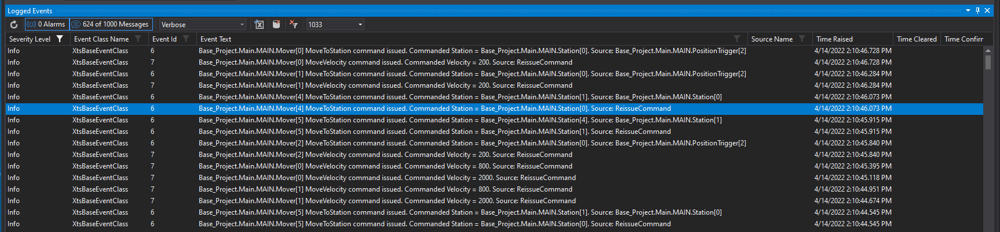

# Event Logger

When the occasional programmed instruction leads to unexpected Mover behavior, it can be useful to look back at a logged history of Mover Events.

In this project, every command issued to any Mover on the track is submitted as a log entry which can be viewed in TwinCAT:

## User Events

To make filtering through these events even easier, customer User Events can also be submitted to the Log.

See [Mover.LogUserEvent](../Objects/Mover.md#loguserevent) for more information.
