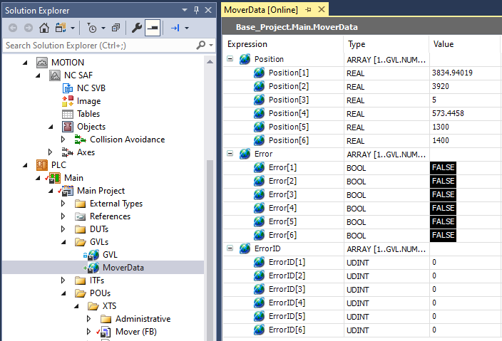

# XTS.MoverData

## Use

The outputs from the `XTS` (FB_XTS) object in the `MAIN` POU consolidates some commonly used mover information into one space to help simplify basic troubleshooting.

The information included in the MoverData GVL is:

- MoverPositions - a REAL representing the current position of the mover on the track.
- MoverErrors - a BOOL when true indicates that there is an error with this mover.
- MoverErrorIDs - a UDINT with an error code produced this mover. Error codes can be looked up in Beckhoff Infosys.

## Fieldbus

The data in MAIN.XTS outputs has deliberately been chosen to use arrays of elementary data types that can be sent through most field buses in their default configuration. This can help facilitate status and error annunciation a higher level control system if one is used.

