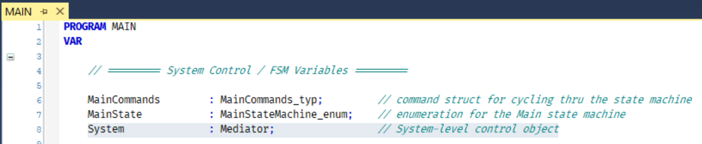
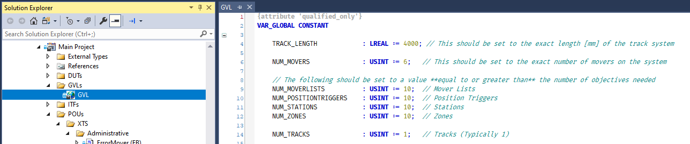

# Mediator

## Broad Concept

Most mover actions can be represented as a combination of a Station, Position Trigger or Zone and a mover. However there are some system-level concepts that require knowledge of all of the stations, movers, zones, etc. The Mediator fulfills this role.

By using the system level Mediator, functionality such as next and previous movers can be realized and tasks that need to be called once for the entire system can be managed such as locating Mover 1 at startup.

Finally, the Mediator handles calling the necessary `.Cyclic()` methods on all objects within the system, simplifying code needed to be managed by the end user.

In this code the Mediator object is instantiated as the variable `System()`.


## Configuration

Code already exists to make the mediator aware of all [Movers](Mover.md), [MoverLists](MoverList.md), [PositionTriggers](PositionTrigger.md), [Stations](Station.md), [Zones](Zone.md) and [Tracks](Track.md). It is executed at the appropriate states in the MAIN program. However, the mediator must be made aware of the number of each object. This is accomplished in the global variable list GVL.



Update the count of each object according to the needs of the system in this list. It's recommended to oversize these arrays so that during runtime debugging additional stations, zones or position triggers can be added without the need to stop and recompile the PLC program.

## Methods

### Cyclic

*Cyclic()*

> Required to be called once per scan. The Mediator will then call all necessary .Cyclic() methods for the objects that are registered to it.

### ResetStatistics
*ResetStatistics()*

Some objects provide statistics that can be used to monitor throughput, utilization, mover velocites and other values and their averages. This method resets all of the statistics collected back to zero after which they begin monitor their values again.

### Other Methods

The following methods are used internally by the Mediator and are not intended for direct access.

- AddMover
- AddMoverList
- AddPositionTrigger
- AddStation
- AddTrack
- AddZone
- EnableGroup

## Properties

### CompleteMoverList
*MoverList*

> Returns a list of all movers within the system.

```
System.CompleteMoverList.HaltAll();
```
### Environment
*I_TcIoXtsEnvironment*

> Returns the environment of this XTS system.
The Mediator initializes FB_TcIoXtsEnvironment and the info server and provides this as a convenience.

This property should always be used after checking if the environment is initialized.

```
IF (System.EnvironmentIsReady) THEN
	System.Environment.GetXpuCount(TRUE);
END_IF;
```

### EnvironmentIsReady
*BOOL*

> Returns the status of the initialization of FB_TcIoXtsEnvironment.

The Mediator initializes FB_TcIoXtsEnvironment and the info server and returns this as a convenience status.

```
IF (System.EnvironmentIsReady) THEN
	// examine an Environment parameter or call a method
END_IF;
```

### GroupEnabled
*BOOL*
> Returns the status of the collision avoidance group enabled state. This is the response from the method .EnableGroup();

### GroupError
*BOOL*
> If an error is generated by the collision avoidance group it is GroupError is true.

### InfoServer
*I_TcIoXtsInfoServer*
> Returns the info server of the XTS system.

The Mediator initializes FB_TcIoXtsEnvironment followed by FB_TcIoXtsInfoServer and provides the info server as a convenience.

This property should always be used after checking if the environment is initialized and the info server is initialized.

```
IF (System.EnvironmentIsReady) THEN
	InfoStationCount := System.InfoServer.GetInfoStationCount();
END_IF;
```

### InfoServerIsReady
*BOOL*
Returns the status of the initialization of FB_TcIoXtsInfoServer.

The Mediator initializes FB_TcIoXtsEnvironment followed by FB_TcIoXtsInfoServer and provides the info server as a convenience status.

```
IF (System.InfoServerIsReady) THEN
	// examine an InfoServer object
END_IF;
```

### Mover1DetectionComplete
*BOOL*
> Returns the status of the mover 1 detection. This is the response from the method .DetectMover1();

### XPU
*­I_TcIoXtsProcessingUnit*
> Returns the XTS Processing Unit of the XTS system.

The Mediator initializes FB_TcIoXtsEnvironment and then provides this interface to the XPU as a convenience.

This property should always be used after checking if the environment is initialized and the info server is initialized.

```
IF (System.EnvironmentIsReady) THEN
	Mode := System.XPU.GetOperationMode();
END_IF;
```