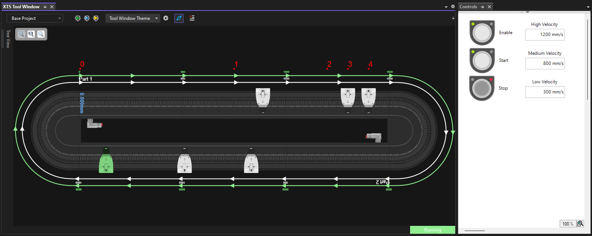

# First Steps

## Project Requirements

For new projects, the latest versions of TwinCAT and XTS software should be utilized.

All XTS projects will require:

- [TF5850](https://www.beckhoff.com/en-us/products/automation/twincat/tfxxxx-twincat-3-functions/tf5xxx-motion/tf5850.html)
- [TF5410](https://www.beckhoff.com/en-us/products/automation/twincat/tfxxxx-twincat-3-functions/tf5xxx-motion/tf5410.html)

!!! abstract "Requirement"

    Project versions 2.0 and later require TwinCAT Build 4026

## Running the Code

This project ships with a ready-to-run oval with a 4m track length and 6 movers that run in simulation mode on your PC, no XTS hardware is required. It can be run as-is for testing and learning purposes.

### Load and Activate

Open the project with TwinCAT. Then activate the configuration using the button on the toolbar.

Confirm that you want to activate the configuration and check the `Autostart PLC Boot Project(s)` option.

You may be prompted to activate a trial license by entering a Captcha. Enter this value to generate the trial license. The project has been designed to work within the limits of a trial license. This license will be valid for 7-days after which it can be renewed indefinitely using this same process.

Finally select OK to `Restart TwinCAT System in Run Mode`

;

Twincat should now be running and can be confirmed by the green icon in the lower right status bar.

### Operate the System

To view the simulated system select `TwinCAT > XTS > XTS Tool Window`.

Then select the `Live View` button.

The movers will be idle at this point. To start the movers in motion open the PLC HMI screen at `Base Project > PLC > Main > Main Project > VISUs > Controls`.

The Controls HMI and XTS Tool Window are both dockable windows, arrange them as you desire to view both simultaneously. Here they have been placed side-by-side.

To start the system first click `Enable` to turn on the Mover's servo closed loop control then `Start` to begin the motion sequence.

The three speeds used in the prepared motion sequence can be edited using the text fields next to the control push buttons.

## Project Customization

The base project includes a simulated configuration for a 4m oval track and 6 movers. This will need to be modified to fit your application.

### Configuring XTS Hardware

In order to modify the program to fit a different track configuration, navigate to the XTS Tool Window.

Then launch the XTS Configurator and follow the prompts to configure your system.

>The configurator occasionally conflicts with existing settings in the project. To avoid this, it can help to delete the following prior to running the XTS Configurator:

- XtsProcessingUnit
- All Mover Axis Objects
- Existing XTS_Task
- Any hardware in the IO section.

### Initialization Settings

Once your hardware configuration is set, you will need to change a few variable parameters in the code to match the system.

Inside *MOTION > Objects > Collision Avoidance (CA Group)*, set the **Rail Length** parameter to match your hardware.

Next, open the MAIN POU file within PLC and modify the number of movers in the XTS declaration `FB_XTS<6>` by changing the value in the brackets.

Next, check that each of your Axis objects are properly linked to a corresponding Mover object.

Lastly, open the *XtsProcessingUnit* within SYSTEM and verify that every setting here is correct

