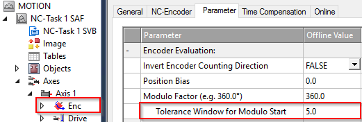

# System Recovery 

> System Recovery is the algorithm which takes the track from cold-and-dark and/or a faulted condition to a known state where your machine process can run.

## Goals
1. Errors on the system should be reset & cleared
2. Conflicts & collisions with other machinery should be cleared
3. Considerations & destinations for product WIP should be calculated
4. Movers should move from *any* potential position to a known desired location & status

## General Approach

Two ACTIONS within the project (*Recovery Oneshot* and *Recovering*) are the implementation placeholders you can replace to build your specific recovery logic.

*RecoverOneshot* is called once immediately after issuing the system start command. Common tasks in this section include sending all movers to a specified location or locations based on the current zone they reside in, or analyzing process data stored in non-volatile memory and sending movers to an appropriate location.

*Recovering* is called cyclically after *RecoverOneshot* and continues to run until the `RecoveryComplete` bit has been set within the routine. A common task in this state is to wait for all movers to come to a standstill.

It may also be necessary to extend the recovery portion of the state machine with additional steps. A common scenario with additional steps may include using the oneshot state to send robots and other tooling to clear positions, the first recovering state to wait for all tooling to be clear and an additional recovering_2 state to start the mover motion.

**Zones** are a particularly useful tool during the recovery process.

## Special Considerations

If a mover is stopped in a station when the system is disabled, your recovery process will likely issue an explicit command for it to return to that station. A mover that is commanded to a position very close to its current position may exhibit unintuitive behavior, such as:

- The Mover makes a complete trip around the loop to reach the position
- The Mover backs up into the position, even though it was downstream of the target position and commanded with `mcDirectionPositive`
- The Mover is showing an active motion command but does not move

#### Mover Takes a Complete Lap

This will occur when the mover is downstream from the target position, even slightly. By default, Mover objects within the project move in the `mcDirectionPositive` direction, so if the mover is downstream of the commanded destination position, it will move downstream all the way around the system to complete the command.

Movers will move slightly when disabled. Magnetic cogging forces create peaks & valleys at the pitch of the stator coils and without active position control, the mover may tend to settle into these valleys.

#### Mover Backs Up Into Position

In some scenarios, movers may move backwards to their destination position. This can occur *even if the mover is downstream of the destination and set to `mcDirectionPositive`*.

This is due to an axis setting called **Tolerance Window for Modulo Start** which applies to modulo axes including XTS movers. A full discussion of this setting can viewed in [Infosys (click)](https://infosys.beckhoff.com/content/1033/tf5410_tc3_collision_avoidance/10232370059.html?id=8994381376675069406).

 
 
#### Mover Shows Active Command But Is Not Moving

This behavior is an extension of the example above with the addition of an immediately preceding mover.

Consider a scenario with a Mover docked with a Station at Position 1000mm. Another mover waits according to Collision Avoidance with a 100mm gap at Position 900mm. The system is disabled, and the movers shift slightly to 1001mm and 902mm, respectively.

Both movers recieve a MoveToStation recovery command to the same station at Position 1000mm. The leading mover is within the **Tolerance Window for Modulo Start** and thus attempts to move backwards. The trailing mover attempts to move forward. The distance between the movers is now 99mm, and Collision Avoidance prevents either mover from moving.

Some resolutions to this can be explored and should be considered in the context of your entire process:

 - During recovery back up all movers by a small amount that is larger than the modulo start window.

 - During regular processing use a staging location for the trailing mover that it outside the collision avoidance gap.

 - During recovery, reduce the modulo start window to zero, forcing all movers to go forward only to their target position.

 - During recovery, send all movers to a known starting location. Then distribute them from there to the necessary stations and processes.