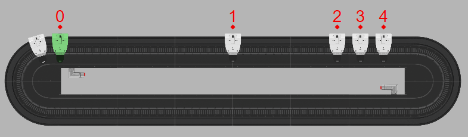
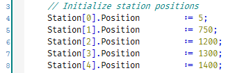
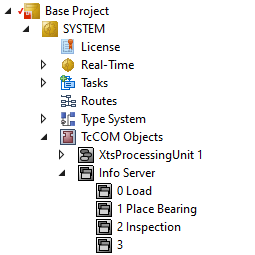
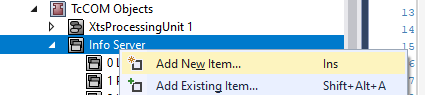
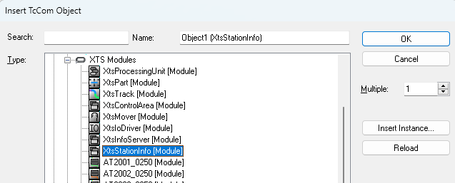

# Visualization

Visualization of the XTS system without actual hardware or on an HMI in production can be accomplished in three ways.

- XTS Tool Window
> available in dropdowns within XAE: *TwinCAT > XTS > XTS Tool Window*
- XTS Viewer
> external application available on the Windows Start Menu
- TcHMI Package
> A drop-in component available as a NuGet package in TcHMI

## Labeling Stations

All three visualization tools allow for labeling stations to aid in following process flow during simulation, debugging, and production. The Station Name feature may need to be turned on in the settings window for any of these tools to get a display like the one shown below.

By default this code will automatically use the first 10 stations and their `.Position` value to place markers. Stations are identified by a number that matches their index in the `MAIN.Station` array. However if a station's position value is 0.0 (and likely unused) it will be skipped by the station marker routine.

## Customizing Station Names

The name associated with each station by default is the station's index in `MAIN.Station` however a more meaningful name can be assigned. In the Solution Explorer locate TcCOM objects under System and then expand the Info Server branch. Rename these objects to match station names such as those shown below. Note that ordering is important. The order of this list matches the indices in `MAIN.Station`. On larger systems we recommend keeping then number as well as adding a descriptive name to help keep this section easy to navigate.

## Adding Additional Stations

By default the code is configured for 10 stations in `MAIN.Stations` and 10 matching stations in the Info Server. Every station being labeled needs a matching station in the info server. However the code will determine if not enough Info Server stations are available and only label those that are available.

If you have increased the size of `MAIN.Stations` you should also consider increasing the number of stations in the Info Server to match. This allows all of them to have labels in the visualization tool. To add stations in the Solution Explorer locate TcCOM objects under System then expand the Info Server branch. Right click the info server branch and select Add New Item.

Then select XTS Modules > XtsInfoServer. You may also enter the number of stations to add at the right using the Multiple field.

Finally, edit the names of the new stations either by continuing numbering or naming them as described in [Customizing Station Names](#customizing-station-names)

## Disabling Automatic Station Naming

In more complex XTS systems and product flows the default station markers generated by the code may not be suitable, or you may have pre-defined stations using the XTS Configurator or manually with TcCOM objects. The station marker code will usually identify these pre-defined stations by looking for non-default values in the TcCOM objects and not overwrite them. But if necessary automatic naming of stations can be completely disabled by setting the the constant global variable `Param.AUTO_POPULATE_STATIONS` to `FALSE`.

## Updating and Refreshing Stations

Station markers are only generated the first time movers are enabled after a cold start (typically power on or activate).

## Additional Documentation

Documentation for the InfoServer and InfoServerStation object which is used by this code to mark stations is available on Infosys:

- [InfoServer](https://infosys.beckhoff.com/content/1033/xts_software/12096705803.html?id=8984960191060995527)
- [InfoStation](https://infosys.beckhoff.com/content/1033/xts_software/12096706827.html?id=1080987481880671218)