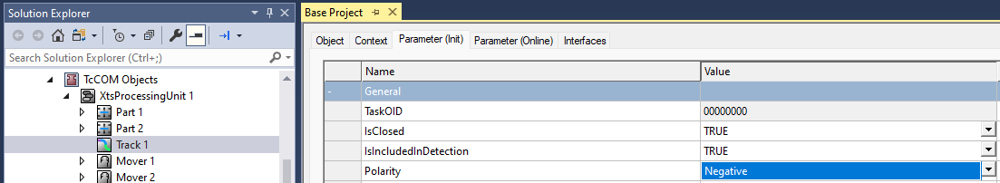

# Programming Quick Tips

Here are a few quick tips to assist in developing with this project:

- Methods are designed to be called once, not repeatedly.

- Collision avoidance should be the source of buffering, there should rarely be a reason for a buffer location to be user defined. 

- Movers Contain an AxisRef. The status values of an AxisRef can be very useful. 

- When using `.CurrentMover` properties (or similar), always wrap usage with a check for `.MoverInPosition` or similar, to verify that the pointers are valid. See [`ErrorMovers`](../CodeReference/Diagnostics/ErrorMovers.md) for more information.

- When reconfiguring the project for new hardware, be sure to delete elements of a previous configuration. More info on this is included in the First Steps section.

- When configuring new hardware, be sure that *Is Closed* and *Is Included in Detection* options are set correctly for tracks and parts.

- When programming recovery scenarios, be sure to unregister movers from objectives where necessary.

# General Code Tips

More generally, here are some recommendations regarding the architecture of your solution:

- Proper code should not depend on the number of movers added to the system, and should be easily scalable when movers are added or removed from the system. Directly addressing specific movers by ID should be avoided when possible. See Overview for more information.

- "The fleet sails as fast as the slowest ship." Overall system throughput is governed by the slowest individual Station's throughput. Focus on understanding the limiting factors of your routing logic in order to optimize traffic flow. A Mover's maximum velocity rarely affects the overall system throughput.

# Common issues

## Changing the forward direction of the track

Depending on the machine layout and the mounting needs of the motor modules the default direction of the track positions (clockwise for face-up motor modules) may not be desired. It is possible to invert the track's direction by changing the following settings.

For each Track set in the XTS Processing Unit set `Parameter > General > Polarity` to `Negative`.

There are some additional considerations to be aware of when inverting the track direction, especially if the track direction is changed after portions of code have been written and tested.

## Next and previous movers

When looking for the next and previous movers on a system, for example when working with 2-up stations, movers that have been referenced directly such as Mover[i] and Mover[i+1] may no longer be in the expected order. Functions such as [`Mover.NextMover()`](../CodeReference/Objects/Mover.md#nextmover), [`Mover.PreviousMover()`](../CodeReference/Objects/Mover.md#previousmover) or [`Zone.CurrentMoverList.GetMoverByLocation()`](../CodeReference/Objects/MoverList.md#getmoverbylocation) are the recommended methods. These methods will also handle an inverted track direction correctly.