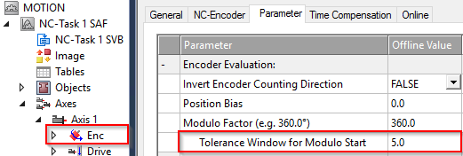

# Recovery 
The process of starting up an XTS system and powering on the movers is handled by this code in a basic manner. After all movers are powered on they will move to a fixed starting location and then being a pre-defined motion sequence from the begining.

While this method of starting over after a cold-start situation is simple, it is only provided as a starting point for the overall recovery method that may need to be implemented for the desired process. There is no way for this example code to handle all possible recovery scenarios that include things like loss of product on parts, movers that have changed position while the machine was powered off, can or should product be re-processed, can product be sent to the last known completed process, etc.

The solution to these recovery scenarios is highly dependent on the specification of the process and product being produced on the XTS system. Two states in the main state machine have been provided as an example of where this type of recovery process could be implemented: `MS_ONESHOT_RECOVER` and `MS_RECOVERING`.

`MS_ONESHOT_RECOVER` is called once immediately after issuing the start command. Common tasks in this section include sending all movers to a specified location or locations based on the current zone they reside in, or analyzing process data stored in non-volatile memory and sending movers to this location.

`MS_RECOVERING` is called cyclically after `MS_ONESHOT_RECOVER` and transitions to `MS_RUN` after the if statement at the bottom of the sequence is satisfied. A common task in this state is to wait for all movers to come to a standstill.

It may also be necessary to extend the recovery portion of the state machine with additional steps. A common scenario with additional steps may include using the oneshot state to send robots and other tooling to clear positions, the first recovering state to wait for all tooling to be clear and an additional recovering_2 state to start the mover motion.

# Backing up during recovery (or re-commanding a position)

When commanding a mover to a position that it's already physically at, some unexpected behaviors may be observed:

- The mover makes a complete trip around the loop to reach the position
- The mover backs up into the position, even though it was downstream of the target position
- The mover is showing an active motion command but is not moving

These are all expected outcomes of re-commanding a mover to it's current position. There are two typical scenarios when this might happen.

 - After powering down the system (or just disabling movers) the recovery process may send some movers to a location they are already at.
 - During regular processing, after some external force such as a press has acted on a mover, it may be desirable to send the mover to the target location again to correct for any position error caused by the external force.

 In these situations the mover's behavior is predictable when several related parameters are known. These may need to be taken into account when re-commanding a mover to a position. A full discussion of the underlying collision avoidance parameters can viewed in [infosys](https://infosys.beckhoff.com/content/1033/tf5410_tc3_collision_avoidance/10232370059.html?id=8994381376675069406). The practical application of this in XTS is discussed below.

 ## Mover takes a complete lap

 This happens when the mover is downstream from the target position, but just slightly. By default the XTS system is set to use an "always positive". The mover is a physical servo system and thus is never positioned exactly on a target position. It will always be (at the sub-micron level) just ahead of or behind the target position. Because of this, at the instant the mover is commanded if it is ahead of the target position the "always positive" command will send the mover through a complete lap to reach the target.

 This behavior can be tuned by adjusting the modulo start window for each mover axis.

 
 
 When the mover is downstream from the target position, but within the modulo start window it will attempt to back up into the target position.

 ## Mover backs into position
 This is a function of the `Modulo Start Window` described in the previous section.

 ## Mover has command but is idle
 This section is an extension of [Mover Backs Into Position](#mover-backs-into-position) above with addition of an immediately preceding mover.

 When the mover is in a situation where it could back up to reach the target, but there is an immediately preceding mover at the gap specified for collision avoidance the collision avoidance algorithm will keep the two movers separated. Without the mover in the trailing position also backing up simultaneously the lead mover is essentially dead-locked and can not make it to the target position. Some resolutions to this can be explored and should be considered in the context of your entire process:

 - During recovery back up all movers by a small amount that is larger than the modulo start window.

 - During regular processing use a staging location for the trailing mover that it outside the collision avoidance gap. This is the preferred solution for one-off stations that may externally push the mover during normal processing.

 - During recovery, reduce the modulo start window to zero, forcing all movers to go forward only to their target position.

 - During recovery, send all movers to a known starting location. Then distribute them from there to the necessary stations and processes.